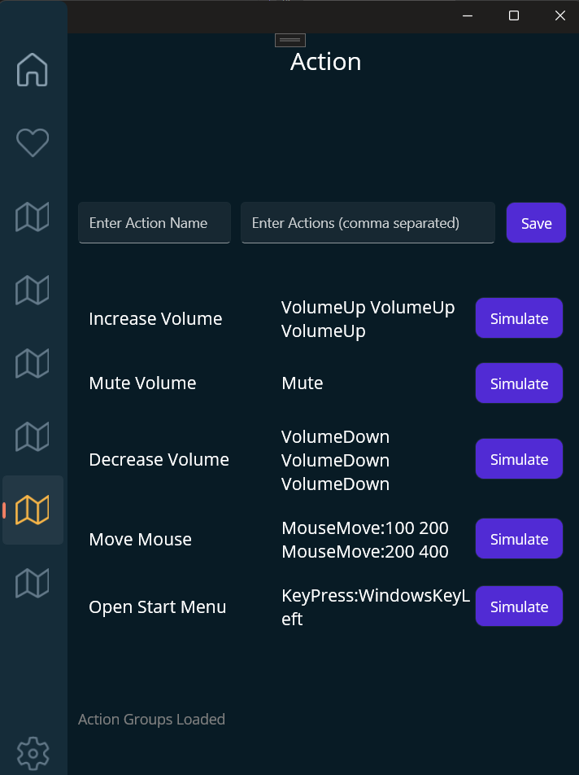

# C_Simple

C_Simple is a .NET MAUI application designed to provide a simple and intuitive interface for navigating between multiple pages. This app demonstrates the use of a navigation bar, tabbed navigation, and basic page layouts in .NET MAUI.

## Table of Contents

- [Introduction](#introduction)
- [Features](#features)
- [Installation](#installation)
- [Usage](#usage)
- [Project Structure](#project-structure)
- [Navigation](#navigation)
- [Contributing](#contributing)
- [License](#license)

## Introduction

C_Simple is a beginner-friendly project that showcases how to build a multi-page .NET MAUI app with a navigation bar and tabbed navigation. It is ideal for those new to .NET MAUI and looking to learn the basics of mobile app development using .NET technologies.



This app styling was inspired by https://github.com/dotnet/maui-samples/tree/main/8.0/Apps/WeatherTwentyOne

## Features

- **Multi-page Navigation:** Navigate between Home, Login, Inputs, Contact, and About pages.
- **Top Navigation Bar:** A centralized `Navbar.xaml` for easy navigation across the app.
- **Tabbed Navigation:** Utilize a `TabBar` within the `AppShell` to switch between key pages.
- **Responsive Layout:** The app is designed to work on multiple platforms, including iOS, Android, and Windows.

## Installation

1. **Clone the Repository:**
   ```bash
   git clone https://github.com/yourusername/C_Simple.git

2. **Open the Project:**

    Open the solution file (C_Simple.sln) in Visual Studio 2022.

3. **Restore NuGet Packages:**

    In Visual Studio, right-click on the solution in Solution Explorer and select "Restore NuGet Packages."

4. **Build the Project:**

    Press Ctrl+Shift+B or click on "Build > Build Solution" in the top menu.

5. **Run the App:**

    Choose your target platform (iOS, Android, Windows) and press F5 to run the app.

## Usage

**Home Page:**

 The default landing page of the app with buttons for navigation.

**Login Page:**

A simple login form.

**Inputs Page:**

Demonstrates form input handling.

**Contact Page:**

A page to showcase contact details or form.

**About Page:**

Provides information about the app.

## Project Structure

```
plaintext
Copy code
C_Simple/
├── C_Simple.sln
├── App.xaml
├── AppShell.xaml
├── MainPage.xaml
├── Pages/
│   ├── HomePage.xaml
│   ├── LoginPage.xaml
│   ├── InputsPage.xaml
│   ├── ContactPage.xaml
│   └── AboutPage.xaml
├── Views/
│   ├── Navbar.xaml
│   └── OtherViewFiles.xaml
└── Resources/
    ├── Fonts/
    ├── Images/
    └── Styles/
```

## Navigation

**Top Navigation Bar:**

 The Navbar.xaml is included at the top of each page for easy navigation.

**Tab Bar Navigation:**

 The AppShell.xaml uses a TabBar to enable tabbed navigation between major sections of the app.

## Contributing

Contributions are welcome! Please feel free to submit a pull request or open an issue for any feature requests or bug fixes.

## License

This project is licensed under the MIT License - see the LICENSE file for details.
